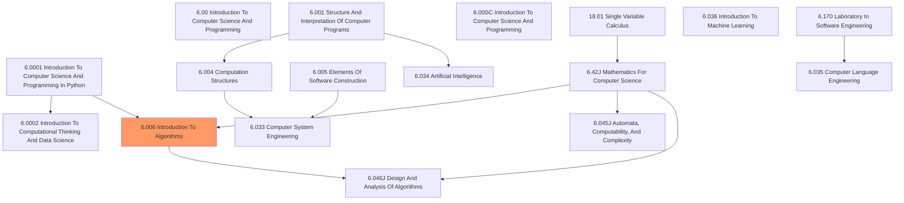

# Learning Path

# Reference

## 6.0001 Introduction To Computer Science And Programming In Python

- [YouTube play list](https://www.youtube.com/playlist?list=PLUl4u3cNGP63WbdFxL8giv4yhgdMGaZNA)
- [MIT OCW page](https://mitocw.ups.edu.ec/courses/electrical-engineering-and-computer-science/6-0001-introduction-to-computer-science-and-programming-in-python-fall-2016/index.htm)