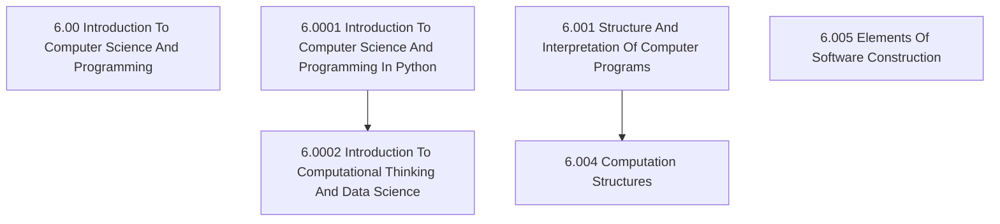

# Learning Path

```mermaid
  graph TD;
    1[6.00 Introduction To Computer Science And Programming]
    2[6.0001 Introduction To Computer Science And Programming In Python] --> 3[6.0002 Introduction To Computational Thinking And Data Science]
    4[6.001 Structure And Interpretation Of Computer Programs]--> 5[6.004 Computation Structures]
    6[6.005 Elements Of Software Construction]
```